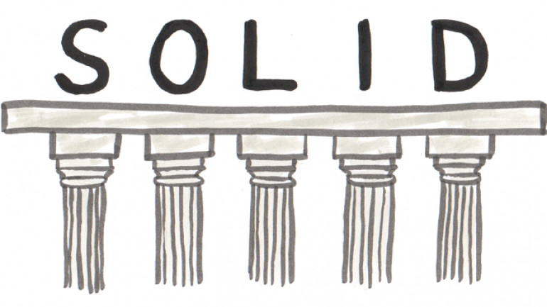
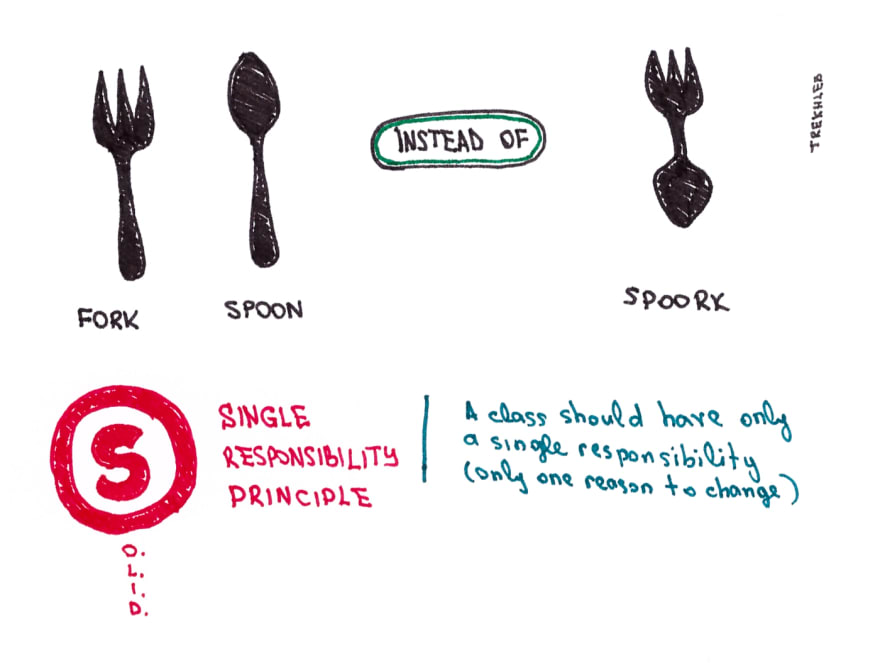
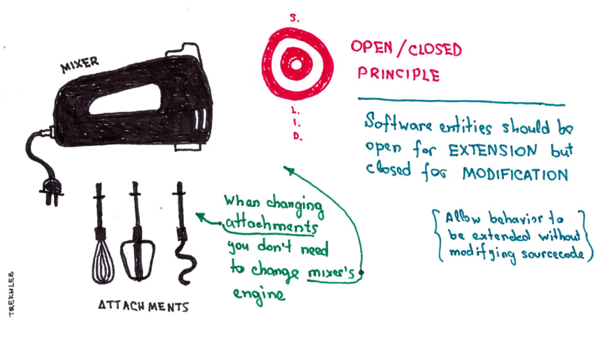
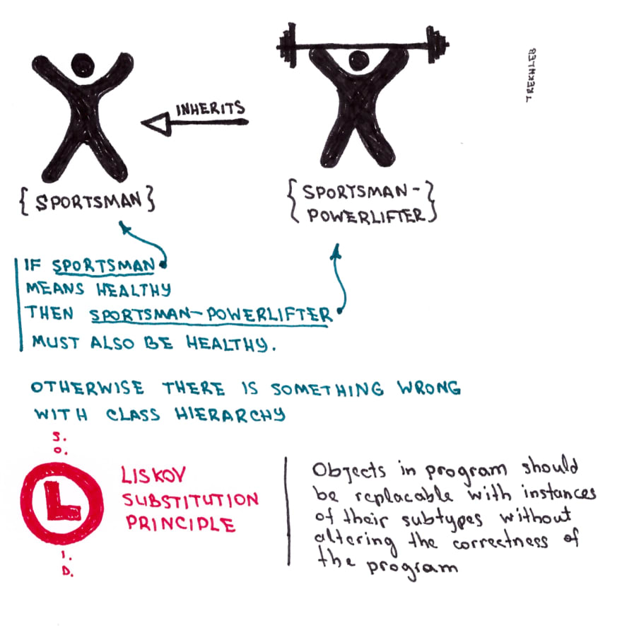
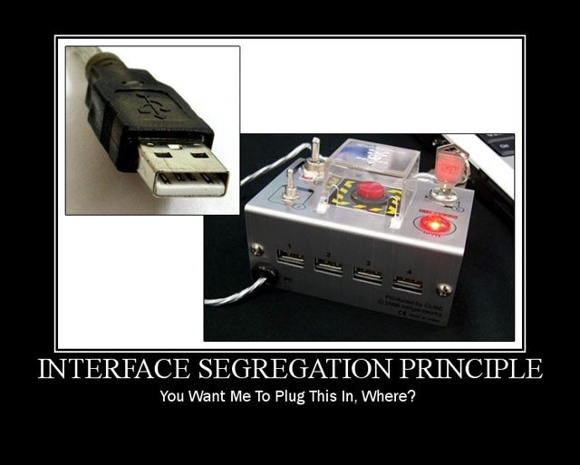
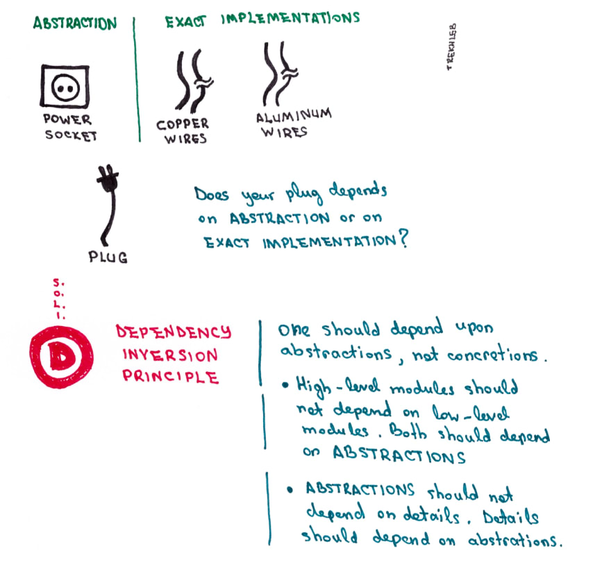

# SOLID
This example is about the SOLID principles of object-oriented programming.

## Single Responsibility Principle

*A class should only have a single responsibility, that is, only changes to one part of the software's specification should be able to affect the specification of the class.

## Open/Closed Principle

*"Software entities ... should be open for extension, but closed for modification."

## Liskov Substitution Principle

*"Objects in a program should be replaceable with instances of their subtypes without altering the correctness of that program." See also design by contract.

## Interface Segregation Principle

*Many client-specific interfaces are better than one general-purpose interface.

## Dependency Inversion Principle

*One should "depend upon abstractions, not concretions".

